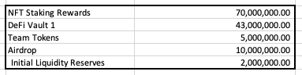
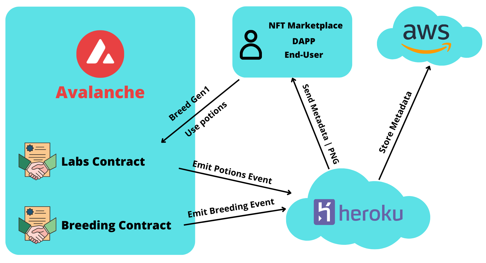

<a name="readme-top"></a>
<!-- PROJECT LOGO -->
<br />
<div align="center">
  <a href="https://github.com/YassineSMARA/ryu-breeding-contracts">
    
  </a>

<h3 align="center">Ryu Breeding Contracts</h3>

  <p align="center">
    The Smart-Contracts of Breeding and Potions of the RYU project
    <br />
    <br />
    <a href="https://ryunft.com">View Live Version</a>
    ·
    <a href="https://marketplace.kalao.io/collection/0x13d933eb47f41cbc0687376622d03a8da10feab6">Ryu Collection</a>
    ·
    <a href="https://marketplace.kalao.io/collection/0xa9de371071e96e2c9e3a907e5c561a6738302eb1">RyuGen2 Collection</a>
  </p>
</div>


<!-- TABLE OF CONTENTS -->
<details>
  <summary>Table of Contents</summary>
  <ol>
    <li>
      <a href="#about-the-project">About The Project</a>
      <ul>
        <li><a href="#built-with">Built With</a></li>
      </ul>
      <ul>
        <li><a href="#ryu-gen1">Ryu Gen1</a></li>
      </ul>
      <ul>
        <li><a href="#nryu">$nRyu</a></li>
      </ul>
      <ul>
        <li><a href="#ryu-gen2">Ryu Gen2</a></li>
      </ul>
      <ul>
        <li><a href="#architecture">Architecture</a></li>
      </ul>
    </li>
    <li><a href="#breeding">Breeding</a></li>
    <li>
      <a href="#potions">Potions</a>
      <ul>
        <li><a href="#speed-up">Speed-up</a></li>
        <li><a href="#strip-down">Strip-Down</a></li>
        <li><a href="#fraternal-twins">Fraternal Twins</a></li>
        <li><a href="#identical-twins">Identical Twins</a></li>
      </ul>
    </li>
    <li>
      <a href="#getting-started">Getting Started</a>
      <ul>
        <li><a href="#prerequisites">Prerequisites</a></li>
        <li><a href="#installation">Installation</a></li>
      </ul>
    </li>
    <li>
      <a href="#usage">Usage</a>
       <ul>
        <li><a href="#scripts">Scripts</a></li>
      </ul>
    </li>
    <li><a href="#test">Test</a></li>
    <li><a href="#contact">Contact</a></li>
  </ol>
</details>


<!-- ABOUT THE PROJECT -->
## About The Project

This repository contains the contracts used for the breeding of the RYU collection.<br>
These are EVM compatible.<br>
All contracts are upgradable due to a choice requested by the RYU team to eventually add features.<br>
They also contain the logic of the potions used for the NFT of generation 2.

<p align="right">(<a href="#readme-top">back to top</a>)</p>

### Built With

<br>
<p align="left">
  <a href="https://hardhat.org" target="_blank"> 
    
  </a>
  <a href="https://mochajs.org" target="_blank"> 
    
  </a>
  <a href="https://chaijs.com" target="_blank"> 
    
  </a>
</p>
<p align="right">(<a href="#readme-top">back to top</a>)</p>

<!-- Ryu Gen1 -->
## Ryu Gen1
<div align="center">
  
</div>
<br>
Ryu NFT is a collection of ERC721 tokens available on the Avalanche blockchain.<br>
This one has already realized more than 10 000 $AVAX volume.<br>

#### Tokenomics 
The collection <strong>sold out</strong> at <strong>3333 NFT</strong>, the mint price was <strong>2.22 $AVAX</strong>.
<br>

#### Description 
Gen1 dragons include 3234 base and 99 legendary which can breed and be staked for daily $nRyu.<br>
By staking their Ryu Gen1 users can generate $nRyu.

<a href="https://marketplace.kalao.io/collection/0x13d933eb47f41cbc0687376622d03a8da10feab6" target="_blank"> 
  🛒 Check the collection on Kalao
</a>

<p align="right">(<a href="#readme-top">back to top</a>)</p>

<!-- $nRyu -->
## $nRyu
<div align="center">
  
</div>
<br>
$nRYU is the Gen1 staking rewards token. It's an ERC20 token.<br> 

#### Tokenomics 
$nRYU has a hard cap supply of <strong>130,000,000 tokens</strong>. 
<div align="center">
  
</div>
<br>

#### Description 
The $nRYU token can be utilized on Breeding, Potions acquisitions, Gen2 Prestige system, and more.

<a href="https://snowtrace.io/token/0x0FC468c8E2003C0e6Ab0e60DBf02b01ce27B4c7f" target="_blank"> 
  🔍 Check the token on Snowtrace
</a>

<p align="right">(<a href="#readme-top">back to top</a>)</p>

<!-- Ryu Gen2 -->
## Ryu Gen2

<div align="center">
  
</div>
<br>
RyuGen2 is a collection of ERC721 tokens available on the Avalanche blockchain.<br>
These tokens are only obtainable by breeding Ryu Gen1 tokens or by using potions from the lab.<br>

#### Tokenomics 
The collection is capped at <strong>9999 NFT</strong>.
<br>

#### Description 
Ryu Gen2 is the first generation of offspring in the Ryu Ecosystem. Stake these NFTs to earn $nRyu.

<a href="https://marketplace.kalao.io/collection/0xa9de371071e96e2c9e3a907e5c561a6738302eb1" target="_blank"> 
  🛒 Check the collection on Kalao
</a>


<p align="right">(<a href="#readme-top">back to top</a>)</p>

<!-- Architecture -->
## Architecture
The project is articulated in 3 parts that I have all imagined, created, and developed.<br>
This choice was made to respect a budget and a deadline.<br>

The first component of this project is smart contracts: `BreedingFactory.sol` and `Labs.sol`. The main function of these contracts is to set limits, restrictions, and on-chain payments ( Checking stamina, Burning $nRyu, etc...). They also allow the creation of the new ERC721 tokens.<br>

The decision was taken to keep the metadata off-chain to be able to modify them following the uses of the potions and to avoid the problem of randomization related to the specificities of the blockchain (the attributes of the tokens of Gen2 being allotted randomly according to the attributes of the parents). Thus at the time of each use of potions / or coupling of tokens, the smart contract emits events with the data necessary for the creation of the metadata.<br>

This is where the second component of the project comes in: the API.<br>

This one is hosted on Heroku. Its operation is the following, with each call to know the metadata of a token the API will according to the case: create the metadata, modify the metadata or simply return them. With each creation or modification, it will save the metadata on an Amazon S3 compartment.<br>

As for the NFT images, they have are created on the fly at each call to the API thanks to the metadata.<br>

The third component is the Amazon S3 compartment, which is simply used to save the metadata in JSON files. When the NFT of Gen2 will have been created and all the potions will have been used the JSON file will be recovered and stored on IPFS, the URI present in the smart contract will be then modified and the data will become immutable.<br>

<div align="center">
  
</div>
<br>

<p align="right">(<a href="#readme-top">back to top</a>)</p>

<!-- Breeding -->
## Breeding

Breeding dragons requires the user to have two dragons with available stamina. Dragon breeders are the only way Gen2 dragons can be born. Breeding dragons cost 2000 $nRYU.<br>

Breeding works on a points system (P). Base dragons start with 20 points for breeding stamina, legendary dragons start with 30 points. Breeding with a legendary burns 20 points, and breeding with a base burns 10 points. Once a dragon reaches 0 points, the dragon is done breeding. Stamina is drained from Dragon A in the breeding pair. The first selected dragon is the one to lose stamina points for the production of one egg.<br>

There is an incubation period for the Gen2 dragons. 33 days length of the incubation period, on the 33rd day, the Gen2 NFT is revealed with its traits and rarity: <br>
* Eggs will be tradable before the incubation period is reached. 
* This incubation period can be sped up by using potions. 
<br>

All Possible Breeding Routes:<br>
* A Legendary (30P) can breed 1x with another Legendary (-20P) AND 1x with a Base (-10P) = 0P A Legendary (30P) can breed 3x with a Base (-30P) = 0 P
* A Base (20P) can breed 1x with a Legendary (-20P) = 0 P
* A Base (20P) can breed 2x with another Base (-20P) = 0 P

<p align="right">(<a href="#readme-top">back to top</a>)</p>


<!-- Potions -->
## Potions

Potions are for-pay actions on the breeding grounds page.<br>
When buying a potion, a percentage of the cost is automatically burned and the rest sent to the treasury.<br>
In total there are four types of potions, all with a different purpose.<br>
Each type of potion will have a maximum of global uses. This means that only x potions can be used for the whole ecosystem.<br>

### Speed-up
<br>
Cost : <strong>3300 $nRyu</strong> for the first use and <strong>5500 $nRyu</strong> for the second.<br>
The purpose of this potion is to reduce incubation time in half.<br>
* The potion can be used twice and will reduce incubation time in half.<br>
* This potion has a maximum usage of 2 for each RyuGen2 ERC721.<br>
* This potion can only be used while the egg is hatching.<br>

### Strip-Down
<br>
Cost : <strong>5000 $nRyu</strong>.<br>
The purpose of this potion is to remove all the attributes of the token except the background and its body.<br>
* This potion can only be used 1000 times for the whole ecosystem.<br>
* The potion can only be used once on a token from the same pair of parents including order.<br>
* This potion can only be used once the egg has hatched.<br>


### Fraternal Twins
<br>
Cost : <strong>7500 $nRyu</strong>.<br>
The purpose of this potion is to breed another token with the same parents without using stamina.<br>
* This potion can only be used 3000 times for the whole ecosystem.<br>
* The potion can only be used once on a token from the same pair of parents including order.<br>

### Identical Twins
<br>
Cost : <strong>15000 $nRyu</strong>.<br>
The purpose of this potion is to create an identical copy of a RyuGen2 Token, attributes included.<br>
* This potion can only be used 2500 times for the whole ecosystem.<br>
* The potion can only be used once on a token from the same pair of parents including order.<br>

<p align="right">(<a href="#readme-top">back to top</a>)</p>

<!-- GETTING STARTED -->
## Getting Started

To get a local copy up and running follow these simple example steps.

### Prerequisites

* npm
  ```sh
  npm install npm@latest -g
  ```
* hardhat
  ```sh
  npm install hardhat
  ```

### Installation

1. Clone the repo
   ```sh
   git clone https://github.com/YassineSMARA/ryu-breeding-contracts.git
   ```
2. Install NPM packages
   ```sh
   npm install
   ```
3. Enter your PRIVATE_KEY in `.env.example and rename the file to `.env`
   ```env
   PRIVATE_KEY=ENTER_YOUR_PRIVATE_KEY
   ```

<p align="right">(<a href="#readme-top">back to top</a>)</p>

<!-- USAGE EXAMPLES -->
## Usage
Try running some of the following tasks:

```shell
npx hardhat accounts
npx hardhat compile
npx hardhat clean
npx hardhat test
npx hardhat node
npx hardhat help
REPORT_GAS=true npx hardhat test
npx hardhat coverage
npx hardhat run scripts/deploy.ts
TS_NODE_FILES=true npx ts-node scripts/deploy.ts
npx eslint '**/*.{js,ts}'
npx eslint '**/*.{js,ts}' --fix
npx prettier '**/*.{json,sol,md}' --check
npx prettier '**/*.{json,sol,md}' --write
npx solhint 'contracts/**/*.sol'
npx solhint 'contracts/**/*.sol' --fix
```
### Scripts

Some scripts are available for contract functions under the scripts directory.<br>
A deployment script is also available: `scripts/deployMock.ts`
<br><br>
To run a script :
```shell
npx hardhat run scripts/SCRIPT_NAME.ts
```

<!-- Test -->
## Test

The coverage is not 100% for the `RyuGen2.sol` contract because the `_burn` function is overloaded to solve the inheritance problem, but this one being internal and not being used anywhere is therefore not testable. Might be solved by using hardhat-exposed library.<br>

Mock contracts are ignored as they are only present to simulate the smart contracts already deployed on the mainnet.<br>

<div align="center">
  
</div>

<p align="right">(<a href="#readme-top">back to top</a>)</p>

<!-- CONTACT -->
## Contact

Yassine SMARA <br>
Discord: Krabs#9454 <br>
Mail: 1yassine.smara@gmail.com

<p align="right">(<a href="#readme-top">back to top</a>)</p>
